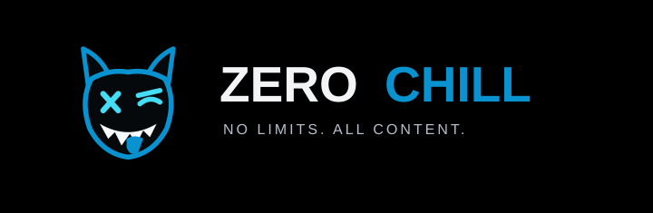

<p align="center">
  
</p>

<h1 align="center">ZEROCHILL</h1>

<p align="center">
  <strong>NO LIMITS. ALL CONTENT.</strong>
</p>

<p align="center">
  Native Android feeds, creator galleries, full-screen video, downloads, favorites, history, and personal lists in an OLED black interface.
</p>

<p align="center">
  <a href="https://github.com/Addy37/CrazyShitAndroid/releases/latest">
    
  </a>
  
  
  <a href="LICENSE">
    
  </a>
</p>

<p align="center">
  <a href="https://github.com/Addy37/CrazyShitAndroid/releases/latest/download/ZeroChill.apk">
    
  </a>
</p>

<p align="center">
  <a href="https://github.com/Addy37/CrazyShitAndroid/releases/latest">Latest release</a>
  ·
  <a href="PRIVACY.md">Privacy</a>
  ·
  <a href="NOTICE.md">Rights and ownership</a>
</p>

> [!WARNING]
> **Adults 18+ only.** Connected sources can contain explicit, graphic, violent, or sensitive content. Availability depends on source and region.

## 😈 Pick your poison

| | Area | What you get |
| --- | --- | --- |
| 🔥 | **Home** | Native browsing across supported sources, search, comments, related media, and pagination |
| 📺 | **Shows** | Collections and source-based browsing without bouncing between separate sites |
| 📱 | **ShitTok** | A vertical video feed with autoplay, preloading, history, and full-screen playback |
| 😈 | **OnlyFap** | Creator search with mixed photo and video galleries from supported sources |
| 🎬 | **Player** | Media3 playback, picture-in-picture, resume, speed controls, and gestures |
| 🖤 | **More** | Favorites, Watch Later, history, downloads, settings, and backup tools |

## ⚡ Built to keep moving

ZEROCHILL is designed around fast native browsing instead of sending you through a stack of web pages.

- **Fast source failover:** Home and ShitTok can move past a dead or slow CrazyShit host instead of waiting through long startup delays.
- **ShitTok preloading:** Upcoming video is prepared ahead of your swipe to reduce playback stalls.
- **Progressive creator galleries:** OnlyFap starts showing usable results while more media continues loading.
- **Warm media loading:** Nearby gallery media is prepared ahead of time for quicker browsing.
- **Native playback:** Video stays inside the app with resume, picture-in-picture, gestures, and full-screen controls.

Connected sources currently include CrazyShit, EFukt, Bunkr, Fapello, and WikiFeet. Source availability can change. Account sign-in is still marked **Coming Soon** in this release.

## 📲 Install ZEROCHILL

<p align="center">
  <a href="https://github.com/Addy37/CrazyShitAndroid/releases/latest/download/ZeroChill.apk">
    
  </a>
</p>

1. Download **[ZeroChill.apk](https://github.com/Addy37/CrazyShitAndroid/releases/latest/download/ZeroChill.apk)** from the [latest release](https://github.com/Addy37/CrazyShitAndroid/releases/latest).
2. Open the APK.
3. Allow installation from your browser or file manager if Android asks.

### Already have CrazyShit installed?

Install the signed ZEROCHILL APK directly over it.

**Do not uninstall the old app first.**

ZEROCHILL keeps the same Android application ID and signing identity, so Android treats it as a normal update and retains your app data, favorites, history, downloads, and settings.

The `.dev` debug package installs separately and does not update stable installs.

**Requirements:** Android 8.0 (API 26) or newer.

New stable releases publish one signed install file, **ZeroChill.apk**, plus **SHA256SUMS.txt** on [GitHub Releases](https://github.com/Addy37/CrazyShitAndroid/releases). Older versioned releases can still contain legacy APK aliases.

## 🔌 Content sources

ZEROCHILL is a native client for supported third-party sources. It does not bundle their media.

A source can change, slow down, block a region, or go offline at any time. ZEROCHILL keeps known-good local behavior and uses its source handling logic to reduce the impact when one source has problems.

## 🔒 Privacy

ZEROCHILL sends aggregate usage events to its project service, including app opens, version, section, source, and creator interest.

It uses rotating hashed keys for daily, weekly, and monthly counts. Optional feedback sends the details you submit plus device and app context.

Read **[PRIVACY.md](PRIVACY.md)** for the full description of what the app sends and stores locally.

## ⚖️ Rights and ownership

ZEROCHILL is an independent community client. It is not affiliated with or endorsed by the connected websites.

Their content and branding belong to their respective owners. The app does not bundle their media or bypass access controls.

See **[NOTICE.md](NOTICE.md)** and the **[MIT License](LICENSE)**.

## 🛠️ Build from source

<p>
  <a href="https://github.com/Addy37/CrazyShitAndroid/actions/workflows/build-apk.yml">
    
  </a>
</p>

Use:

- Java 17
- Gradle 8.7
- Android SDK 35

The main Android module is `app`. The private feedback and analytics companion is `feedbackadmin`.

```bash
gradle --no-daemon :app:testDebugUnitTest :app:testReleaseUnitTest :app:assembleDebug :app:assembleRelease
gradle --no-daemon :feedbackadmin:assembleRelease
```

Local release builds need the private signing variables described in **[SIGNING.md](SIGNING.md)**.

An unsigned or debug-signed build cannot update stable installations. Production APKs are built and verified by the repository release workflow. No signing keys or admin tokens belong in the repository.

---

<p align="center">
  <strong>ZEROCHILL</strong><br>
  <sub>NO LIMITS. ALL CONTENT.</sub>
</p>
